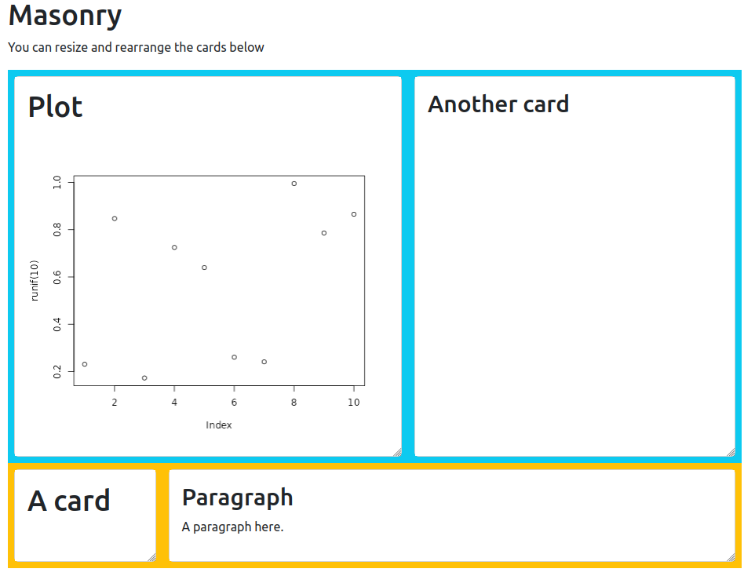
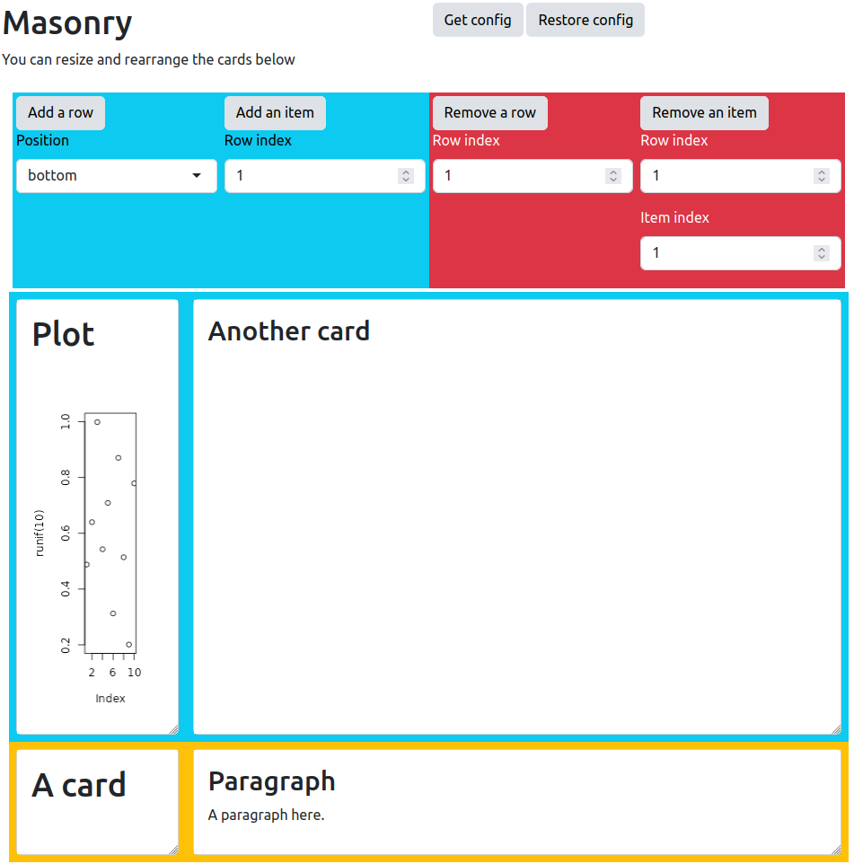

!-- badges: start -->
<!-- badges: end -->

# masonry

Resizeable, draggable grid for shiny.

## Installation

You can install the development version of masonry from [GitHub](https://github.com/) with:

``` r
# install.packages("remotes")
remotes::install_github("blockr-org/masonry")
```

## Usage R

Similar to using `fluidRow` and `column`, create a `masonryGrid`,
place `masonryRow` as children into which you can place `masonryItem`.

```r
masonryGrid(
  id = "myGrid",
  masonryRow(
    classes = "bg-info",
    masonryItem(card(h1("A card"))),
    masonryItem(card(h2("Another card")))
  ),
  masonryRow(
    classes = "bg-warning",
    masonryItem(card(h1("Yet another card"))),
    masonryItem(card(p("A paragraph")))
  ),
  styles = list(items = list(margin = ".5rem"))
)
```

## Usage JavaScript

Create HTML structure.

```html
<div class="masonry-grid">
  <div class="masonry-row">
    <div class="masonry-item">
      <h1>Item1</h1>
    </div>
    <div class="masonry-item">
      <h1>Item2</h1>
    </div>
  </div>
</div>
```

Make interactive.

```js
$(".masonry-grid").masonry();
```

## Example

__Basic Example__

```r
library(shiny)
library(masonry)

card <- \(...){
  div(
    class = "card",
    div(
      class = "card-body bg-white text-dark",
      ...
    )
  )
}

ui <- fluidPage(
  theme = bslib::bs_theme(version = 5L),
  h1("Masonry"),
  p("You can resize and rearrange the cards below"),
  outputMasonry("masonry")
)

server <- \(input, output, session) {
  output$masonry <- renderMasonry({
    masonryGrid(
      id = "myGrid",
      masonryRow(
        classes = "bg-info",
        masonryItem(card(h1("Plot"), plotOutput("base", width = "100%"))),
        masonryItem(card(h2("Another card")))
      ),
      masonryRow(
        classes = "bg-warning",
        masonryItem(card(h1("A card"))),
        masonryItem(card(h2("Paragraph"), div(p("A paragraph here."))))
      ),
      styles = list(items = list(margin = ".5rem"))
    )
  })

  output$base <- renderPlot(plot(runif(10))) 
}

shinyApp(ui, server)
```



__Example of all functionalities__

``` r
library(shiny)
library(masonry)

card <- \(...){
  div(
    class = "card",
    div(
      class = "card-body bg-white text-dark",
      ...
    )
  )
}

ui <- fluidPage(
  theme = bslib::bs_theme(version = 5L),
  div(
    class = "row",
    div(
      class = "col-md-6 p-1",
      h1("Masonry"),
      p("You can resize and rearrange the cards below")
    ),
    div(
      class = "col-md-6 p-1",
      actionButton("getConfig", "Get config"),
      actionButton("restoreConfig", "Restore config")
    )
  ),
  div(
    class = "row m-1",
    div(
      class = "col-md-3 bg-info p-1",
      actionButton("addRow", "Add a row"),
      selectInput("position", "Position", choices = c("bottom", "top"))
    ),
    div(
      class = "col-md-3 bg-info p-1",
      actionButton("addItem", "Add an item"),
      numericInput("rowIndex", "Row index", value = 1L, min = 1, max = 4L)
    ),
    div(
      class = "col-md-3 bg-danger p-1",
      actionButton("removeRow", "Remove a row"),
      numericInput("removeRowIndexx", "Row index", value = 1L, min = 1, max = 4L)
    ),
    div(
      class = "col-md-3 bg-danger p-1",
      actionButton("removeItem", "Remove an item"),
      numericInput("removeRowIndex", "Row index", value = 1L, min = 1, max = 4L),
      numericInput("removeItemIndex", "Item index", value = 1L, min = 1, max = 4L)
    )    
  ),
  masonryGrid(
    id = "myGrid",
    masonryRow(
      classes = "bg-info",
      masonryItem(card(h1("Plot"), plotOutput("base", width = "100%"))),
      masonryItem(card(h2("Another card")))
    ),
    masonryRow(
      classes = "bg-warning",
      masonryItem(card(h1("A card"))),
      masonryItem(card(h2("Paragraph"), div(p("A paragraph here."))))
    ),
    styles = list(items = list(margin = ".5rem"))
  )
)

server <- \(input, output, session) {
  output$base <- renderPlot(plot(runif(10))) 

  observeEvent(input$addRow, {
    masonry_add_row("#myGrid", classes = "bg-dark", position = input$position)
  })

  observeEvent(input$addItem, {
    masonry_add_item("#myGrid", input$rowIndex, item = card(h4("new item", input$addItem)))
  })

  observeEvent(input$getConfig, {
    masonry_get_config("myGrid")
  })

  config <- list()
  observeEvent(input$myGrid_config, {
    config <<- input$myGrid_config
    print(config)
  })

  observeEvent(input$restoreConfig, {
    masonry_restore_config("myGrid", config)
  })

  observeEvent(input$removeItem, {
    masonry_remove_item("#myGrid", input$removeRowIndex, input$removeItemIndex)
  })

  observeEvent(input$removeRow, {
    masonry_remove_row("#myGrid", input$removeRowIndexx)
  })
}

shinyApp(ui, server)
```


